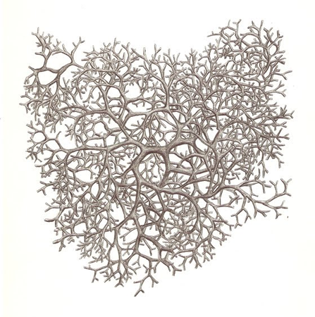
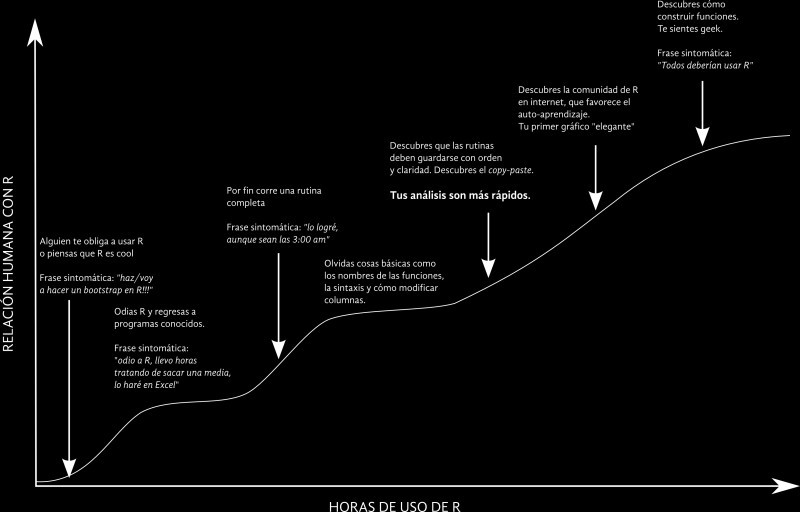
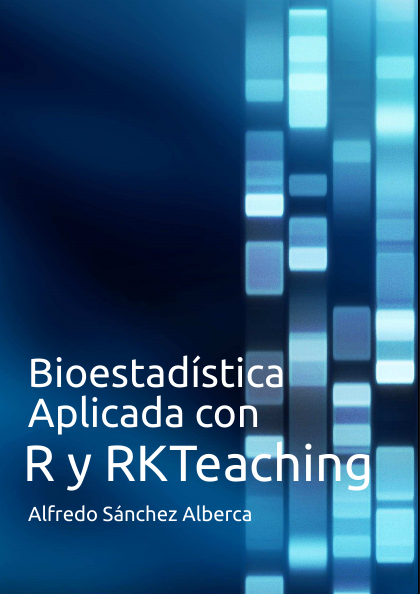
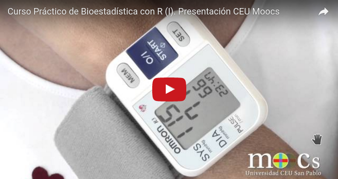

## La apuesta por el conocimiento y el software libre

## La curva de aprendizaje de R

## La interfaz gráfica RKWard

- Software libre
- Multiplataforma
- Fácilmente ampliable mediante un sistema de plugins
- Basada en librerías gráficas Qt
- Salida en formato html
- Orientada tanto a usuarios que no conocen R como a programadores

## El paquete [rk.Teaching](http://aprendeconalf.es/rkteaching/)

###Principios de diseño

- Intuición 
- Simplicidad
- Asistencia al usuario
- Interpretación de resultados
- Pedagogía

## Experiencia docente presencial

## Experiencia docente no presencial

## Más info http://aprendeconalf.es

